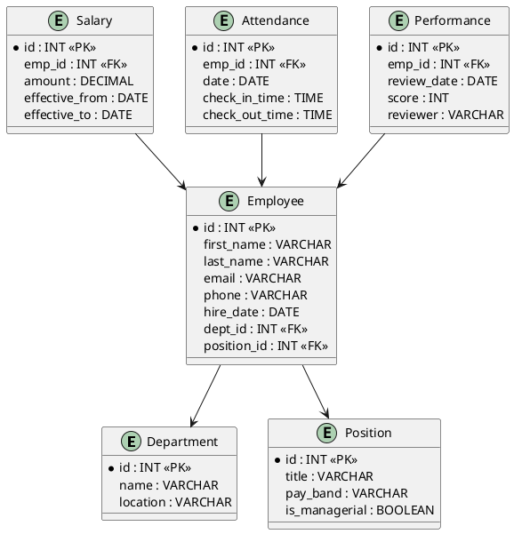
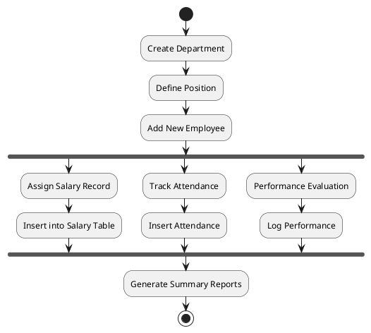

# 💼 DataVerse HRMS — Enterprise-Grade SQL Backend

**DataVerse HRMS** is a production-grade, advanced SQL-powered backend engine tailored for HR systems in real-world enterprises. This system isn't just about CRUD — it's a full-stack-ready, analytics-capable, modular backend designed for reporting, access control, triggers, and business logic.

---

## 🔍 Quick Overview

A modular, production-grade HR backend system powered by MySQL. Includes:

* ✅ DDL + DML + Views + Triggers + RBAC
* 📈 Analytics-ready structure
* 💡 Designed for real-world enterprise scenarios

---

## 📁 Folder Structure

```
dataverse-hrms/
├── database/
│   ├── ddl/
│   │   ├── 00_create_database.sql
│   │   ├── 01_entities/
│   │   │   ├── department.sql
│   │   │   ├── position.sql
│   │   │   ├── employee.sql
│   │   │   ├── salary.sql
│   │   │   ├── attendance.sql
│   │   │   └── performance.sql
│   │   ├── 02_relationships.sql
│   │   ├── 03_constraints.sql
│   │   └── 04_indexes.sql
│   ├── dml/
│   │   └── sample_employees.sql
│   ├── triggers/
│   │   └── trg_salary_change_log.sql
│   ├── procedures/
│   │   └── calculate_salary.sql
│   ├── views/
│   │   └── v_employee_summary.sql
│   ├── functions/
│   │   └── fn_get_age.sql
│   ├── optimization/
│   ├── security/
│   │   ├── role_definitions.sql
│   │   └── privilege_matrix.sql
│   └── utils/
│       └── database_cleanup.sql
├── docs/                       # ERDs, visual docs
├── migrations/
└── .env.example
```

---

## 📊 Entity Relationship Diagram (ERD)


```
📍 Place your ERD.svg file here
```

<details>
<summary>📝 UML Source (for reference)</summary>



</details>

---

## 🔄 Activity Diagram: Employee Lifecycle

>

```
📍 Place your EmployeeLifecycle.svg file here
```

<details>
<summary>📝 UML Source (for reference)</summary>



</details>

---

✅ All components are now coded and documented. This structure represents a fully modular and production-ready SQL backend for enterprise HR systems.

Be sure to replace the SVG placeholders with your actual diagram files for GitHub/Notion integration.
